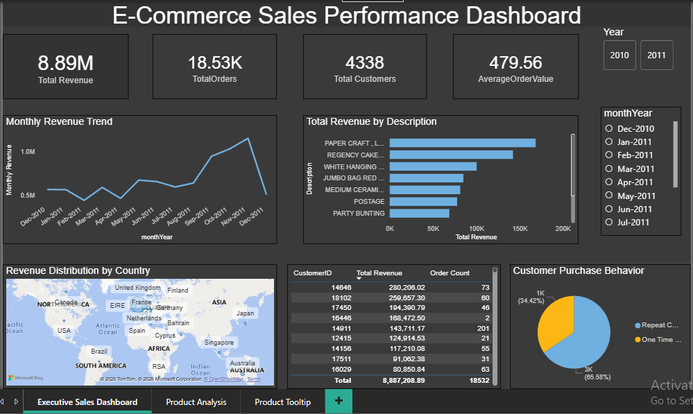
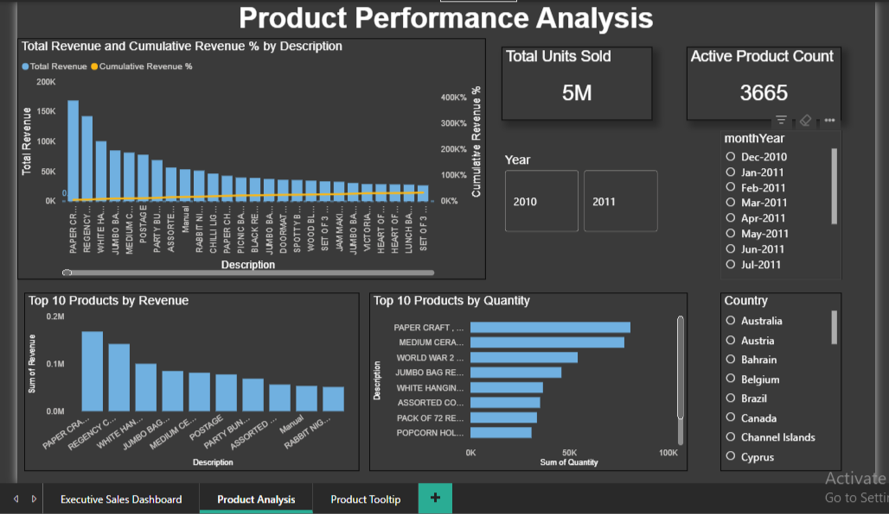

# E-Commerce-Sales-Analysis
E-Commerce sales analysis project using Excel, SQL, and Power BI
# E-Commerce Sales Analysis Dashboard

# Project Overview
This project analyzes an online retail dataset to understand sales performance, product trends, and customer behavior.

## Tools Used
- Excel (Data Cleaning)
- MySQL (Data Handling)
- Power BI (Dashboard & Visualization)

## Key Features
- Total Revenue, Orders, Customers & AOV KPIs
- Monthly Revenue Trend Analysis
- Top Products by Revenue & Quantity
- Country-wise Revenue Distribution
- Interactive slicers and filters
- Custom tooltip for deeper insights

## Key Insights
- A small percentage of products contributes to the majority of revenue (Pareto principle)
- Sales show seasonal trends across months
- Certain countries generate higher revenue

## Dashboard Preview

## Project Report
Refer to the attached project report for detailed explanation.
